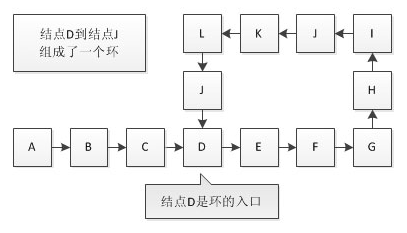
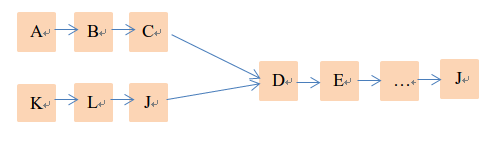
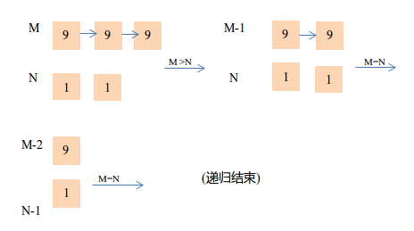

链表相关问题归总
============
### 1.单链表反转
算法1:用额外的两个指针变量存储当前结点的下一个结点`p->next`下下一个结点`p->next->next`依次逆向链接结点即可.时间复杂度O(n),空间复杂度O(1) 另一个算法:使用递归. `head->next = Reverse(head->next)`,生成 一个空表头,`Reverse(head->next)`递归函数内部核心代码:
```cpp
LinkList Rerverse(LinkList head){
        LinkList rHead = Reverse(head->next);
        head->next->next = head;
        head->next = null;
        return rHead;
}
```
算法2:按照头插法依次将后续结点插入到头结点之后,即可实现反转.
### 2.找出单链表的倒数第4个元素
算法:设置两个指针,其中一个先移动4步,接着同步移动两个指针即可.
另外一种算法:使用一个数组`arr[4]`,遍历单链表,将第`0,4,8,...,4n`个元素放入`arr[0]`,将第`1,5,9,...4n+1`个元素放入`arr[1],...`,依次类推,当单链表遍历结束时,`arr`中存放的就是单链表的最后4个元素.接着找出链表最后一个元素在`arr`中的位置`arr[i]`,让`k=(i+1)%4`,则`arr[k]`就是倒数4个元素.
### 3.找出单链表的中间元素
算法:设置两个指针,一个步长为2(即一次移动两步),一个步长为1,步长较大的移动至表尾时步长较小的正好在中间(注意:如果链表长是偶数,则中间元素有两个,要返回步长小的所处位置结点和这个结点的下一个位置结点.
### 4.删除无头单链表的一个节点
算法:`curr->data = curr->next.data; curr->next = curr->next->next;`
### 5.有个二级单链表，其中每个元素都含有一个指向一个单链表的指针。写程序把 这个二级链表展开成一级单链表。
算法:进行两次遍历，外层curr1遍历二级单链表head，内层curr2遍历每个单链表。
### 6.判断单链表是否有环？如何找到环的“起始”点？如何知道环的长度？
算法:

* 设置两个指针,一个步长为1,一个步长为2,同时从表头开始移动,如果**有环**,必定在环中的某个点**相遇**;(注意:步长为2的先走,步长为1的后走,两
      个都走完一次后,再判断两指针元素值是否相等).相遇时,步长为2的指针移动过的距离正好是步长为1的指针移动距离的2倍.
* 将环从相遇点P处"切开",问题转化为计算两个相交"单链表"的交点.分别从两个两个表头(即原表头和相遇点处)出发,两个指针的交点处(第一个公共点)即为环的**起始点**.被切开的两个链表的长度是相等的. 
* 从相遇结点出发,转一圈回来,即可知道**环的长度**.



将环破开为两个单链表(J点是相遇点):


### 7.判断两个单链表是否相交
* 算法1:将第一个链表逐项存入hashtable,遍历第二个链表,如果能在第一个链表中找到,即相交
* 算法2:将第二个链表接到第一个链表尾,从第二个链表头开始遍历,能回到第二个链表头,即有环,有环则必相交
* 算法3:如果两个链表的末尾元素相同，则必相交.即后端对齐,找公共点是否存在.

### 8.两个单链表相交，计算相交点
两个单链表相交,必定呈Y字型;所以,第一个公共点即为交点.(两链表后端对齐先移动较长链表的指针到两链表长度之差长度的位置,再开始同步遍历两链表,即可找出第一个公共点)
### 9.用单链表模拟大正数加法运算
例如：9>9>9>NULL + 1>1>null => 1>0>1>0>NULL
算法:由于链表指针总是指向后的,要处理进位,则自然的想到了使用递归.新生成一个表头结点,初始化为0,根据是否有进位来设置该值为1还是0.如果有进位,该表头结点值为1,并添加到运算结束之后新生成链表的表头(一般使用较长的链表存储计算结果,作为新生成的链表).
```cpp
//假设M>N
int LinkAdd(LinkList head1, LinkList head2,&LinkList newHead,int M, int N)
{
    if(head1 == NULL) 
        return 0;
    int temp,result = 0;
    newHead = new Link(null,0);
    if(M > N)
        {
            //result是低位的进位
            result = LinkAdd(head1->next,head2,newHead->next,M-1,N);
            //做加法
            temp = head1->data + result;
            newHead->date = temp % 10;
            return temp >= 10 ? 1 : 0;
         }
    else{//M==N
            result = LinkAdd(head1->next,head2->next,newHead->next,M-1,N-1);
            //做加法
            temp = head1->data + head2->data + result;
            newHead->date = temp % 10;
            return temp >= 10 ? 1 : 0;
        }
}
```


### 10.删除单链表中重复的元素
算法1:采用哈希表.
<br>算法2:插入法.从头结点开始依次插入后续接点组成新表,将待插入的元素与已在新表中的元素比较,相同的不插入,即可将重复元素删除.
